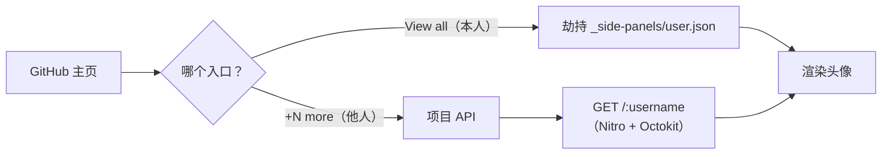

<div align="center">

🚀

# GitHub Unlimited Orgs

**在任意 GitHub 主页展示全部组织 —— 而不只是最前面的几个。**

展开被折叠的 `+N more` / `View all` 头像列表，并保留原生悬停卡片，由自托管 API 提供数据支持。

</div>

---

| 之前                                                       | 之后                                                      |
|------------------------------------------------------------|-----------------------------------------------------------|
|  |  |


## ✨ 特性

- 🔍 **完整组织列表** — GitHub 只会展示少数几个头像，其余的都藏在 `+N more` 之后。本项目会为任意用户加载完整的组织列表。
- 👤 **智能路由** — 自动识别已登录用户自己的主页（`View all` / `/settings/organizations`）和其他用户主页（`+N more`），并分别通过最优通道提供数据。
- ⚡ **数据零丢失** — 你自己的主页数据来自 GitHub 被劫持的 `/_side-panels/user.json` 响应，并配合请求-回放机制，确保数据不会因注入时机而丢失。
- 🪝 **原生悬停卡片** — 注入的头像保留原生 `data-hovercard-url` 属性，GitHub 的悬停卡片完全正常工作。
- 🔁 **SPA 感知** — 能应对 GitHub 的软导航（`turbo:load`、`pjax:end`、`popstate`），并在页面重渲染撕掉注入头像后自愈。
- 🗂️ **会话缓存** — 30 分钟新鲜缓存 + 24 小时陈旧兜底，减少 API 调用并容忍瞬时故障。
- 🧵 **请求去重** — 并发扫描共享同一个在飞请求，每个主页只触发一次 API 调用。
- 📦 **双端交付** — 一个 Chrome MV3 扩展和一个 Tampermonkey 用户脚本，两者共用同一套核心逻辑。

## 🧭 工作原理



1. **内容脚本** 在主页上发现 `Organizations` 区块。
2. 对于 `+N more`（他人主页），它请求自托管的 **API**，该 API 会分页拉取 GitHub 组织列表并批量获取每个组织的详情。
3. 对于 `View all`（你自己的主页），它复用 GitHub 已加载的侧边栏数据，避免额外请求。
4. 缺失的头像被注入到原生 `a.avatar-group-item` 结构中，并保留悬停卡片属性。

---

## 📁 项目结构

```
packages/
├── api/                 # Nitro API 服务器（Octokit）
│   └── src/routes/
│       ├── [username].get.ts   # GET /:username
│       ├── index.ts            # 交互式文档（Scalar）
│       └── openapi.json.ts     # OpenAPI 规范
├── core/                # 共享逻辑：enhancer、DOM、缓存、面板拦截器
├── chrome-extension/    # MV3 扩展（content / background / main-world）
├── tampermonkey/        # Tampermonkey 用户脚本
└── tsconfig/            # 共享 TypeScript 配置
```

## 🧱 技术栈

| 层级 | 技术 |
| --- | --- |
| API 服务器 | [Nitro](https://nitro.build) + [Octokit](https://github.com/octokit/octokit.js) |
| 语言 | TypeScript |
| 构建 | [tsdown](https://tsdown.dev)（Rolldown） |
| 包管理器 | pnpm 12.6（workspace） |
| 目标平台 | Chrome Manifest V3 · Tampermonkey |

## ✅ 环境要求

- Node.js LTS
- pnpm `12.6.0`

## 🚀 快速开始

```bash
# 1. 克隆仓库
git clone https://github.com/lonewolfyx/github-unlimited-orgs.git

# 2. 进入目录
cd github-unlimited-orgs

# 3. 安装依赖
pnpm install

# 4. 配置 API（可选，但推荐 —— 可提升每小时速率限制）
cp packages/api/.env.example packages/api/.env
# 然后在 packages/api/.env 中设置 GITHUB_TOKEN=your_token_here

# 5. 启动 API 服务器
pnpm server:dev
```

API 现已运行在 `http://localhost:3000`。打开 `/` 可查看交互式文档。

## 🧩 使用 Chrome 扩展

从[最新发布](https://github.com/lonewolfyx/github-unlimited-orgs/releases/latest)下载 `github-unlimited-orgs-chrome.zip`，解压后在开启**开发者模式**的 `chrome://extensions` 中加载解压后的目录。

本地构建：

```bash
# 构建扩展（输出到 packages/chrome-extension/dist）
pnpm -F @github-unlimited-orgs/chrome-extension build

# 或监听开发模式
pnpm -F @github-unlimited-orgs/chrome-extension dev
```

然后在 Chrome 中打开 `chrome://extensions`，启用**开发者模式**，点击**加载已解压的扩展程序**并选择 `packages/chrome-extension/dist`。

## 🐒 使用 Tampermonkey 脚本

[安装最新用户脚本](https://github.com/lonewolfyx/github-unlimited-orgs/releases/latest/download/github-unlimited-orgs.user.js)。Tampermonkey 会通过脚本元数据自动检查后续发布。

本地构建：

```bash
# 构建用户脚本
pnpm -F @github-unlimited-orgs/tampermonkey build

# 或监听开发模式
pnpm -F @github-unlimited-orgs/tampermonkey dev
```

在 Tampermonkey 中安装生成的 `packages/tampermonkey/dist/github-unlimited-orgs.user.js`。

## 🔌 API 参考

`GET /:username` — 返回某个 GitHub 用户的完整组织列表。

| 字段 | 类型 | 描述 |
| --- | --- | --- |
| `username` | `string` | 组织登录名 |
| `lable` | `string` | 显示标签 |
| `avatar` | `string` | 头像 URL |
| `description` | `string` | 组织描述 |
| `html_url` | `string` | 组织链接 |
| `join_time` | `string \| null` | 组织创建日期 |

## ⚙️ 配置

| 键 | 位置 | 默认值 | 用途 |
| --- | --- | --- | --- |
| `GITHUB_TOKEN` | `packages/api/.env` | — | 提升 GitHub API 速率限制（60 → 5000 次/小时） |
| `API_BASE_URL` | `packages/core/src/config.ts` | `https://github-unlimited-orgs.vercel.app` | 项目 API 地址 |

## 🧪 Lint

```bash
pnpm lint
# 或自动修复
pnpm lint:fix
```

## 🤝 参与贡献

欢迎贡献！请阅读 [CONTRIBUTING.md](./CONTRIBUTING.md) 了解分支、PR 和提交规范。

## 📄 License

[MIT](./LICENSE) © 2026 lonewolfyx