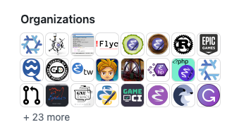
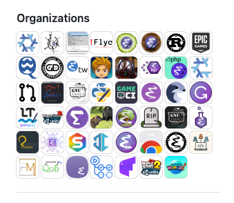
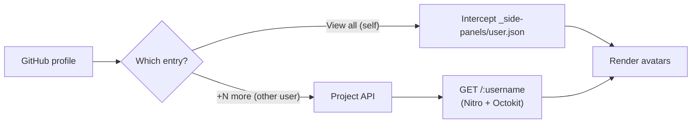

<div align="center">

🚀

# GitHub Unlimited Orgs

**Show every organization on any GitHub profile — not just the first few.**

Expand the collapsed `+N more` / `View all` avatar list with native hover cards, powered by a self-hosted API.

</div>

---


| Before                  | After                                           |
|-------------------------|-------------------------------------------------|
|  |  |


## ✨ Features

- 🔍 **Full organization list** — GitHub only exposes a handful of avatars and hides the rest behind `+N more`. This project loads the complete list for any user.
- 👤 **Smart routing** — detects the signed-in user's own profile (`View all` / `/settings/organizations`) and other users' profiles (`+N more`) and serves each through the optimal channel.
- ⚡ **No data loss** — your own profile is served from GitHub's intercepted `/_side-panels/user.json` response, with a request–replay mechanism so data is never lost to injection timing.
- 🪝 **Native hover cards** — injected avatars keep the original `data-hovercard-url` attribute, so GitHub's hover cards work exactly as expected.
- 🔁 **SPA-aware** — survives GitHub's soft navigation (`turbo:load`, `pjax:end`, `popstate`) and self-heals when a re-render strips the injected avatars.
- 🗂️ **Session caching** — a 30-minute fresh cache plus a 24-hour stale fallback cuts API calls and tolerates transient failures.
- 🧵 **Deduplicated requests** — concurrent scans share a single in-flight request, so each profile triggers exactly one API call.
- 📦 **Two deliverables** — a Chrome MV3 extension and a Tampermonkey userscript, both backed by the same shared core.

## 📸 Demo

| Before | After |
| --- | --- |
|  |  |

## 🧭 How it works



1. The **content script** discovers the `Organizations` section on a profile page.
2. For `+N more` (another user), it queries the self-hosted **API**, which paginates GitHub's org list and batch-fetches each org's details.
3. For `View all` (your own profile), it reuses the side-panel data GitHub already loaded, avoiding an extra request.
4. Missing avatars are injected into the native `a.avatar-group-item` structure with preserved hover-card attributes.

---

## 📁 Project structure

```
packages/
├── api/                 # Nitro API server (Octokit)
│   └── src/routes/
│       ├── [username].get.ts   # GET /:username
│       ├── index.ts            # interactive docs (Scalar)
│       └── openapi.json.ts     # OpenAPI spec
├── core/                # shared logic: enhancer, DOM, cache, panel interceptor
├── chrome-extension/    # MV3 extension (content / background / main-world)
├── tampermonkey/        # Tampermonkey userscript
└── tsconfig/            # shared TypeScript configs
```

## 🧱 Tech stack

| Layer | Technology |
| --- | --- |
| API server | [Nitro](https://nitro.build) + [Octokit](https://github.com/octokit/octokit.js) |
| Language | TypeScript |
| Build | [tsdown](https://tsdown.dev) (Rolldown) |
| Package manager | pnpm 12.6 (workspace) |
| Targets | Chrome Manifest V3 · Tampermonkey |

## ✅ Requirements

- Node.js LTS
- pnpm `12.6.0`

## 🚀 Getting started

```bash
# 1. Clone the repository
git clone https://github.com/lonewolfyx/github-unlimited-orgs.git

# 2. Enter the directory
cd github-unlimited-orgs

# 3. Install dependencies
pnpm install

# 4. Configure the API (optional but recommended — lifts the hourly rate limit)
cp packages/api/.env.example packages/api/.env
# then set GITHUB_TOKEN=your_token_here in packages/api/.env

# 5. Start the API server
pnpm server:dev
```

The API is now running at `http://localhost:3000`. Open `/` for the interactive docs.

## 🧩 Using the Chrome extension

```bash
# Build the extension (outputs to packages/chrome-extension/dist)
pnpm -F @github-unlimited-orgs/chrome-extension build

# Or watch for development
pnpm -F @github-unlimited-orgs/chrome-extension dev
```

Then in Chrome, navigate to `chrome://extensions`, enable **Developer mode**, and **Load unpacked** pointing at `packages/chrome-extension/dist`.

## 🐒 Using the Tampermonkey script

```bash
# Build the userscript
pnpm -F @github-unlimited-orgs/tampermonkey build

# Or watch for development
pnpm -F @github-unlimited-orgs/tampermonkey dev
```

Install the generated `packages/tampermonkey/dist/github-unlimited-orgs.user.js` in Tampermonkey.

## 🔌 API reference

`GET /:username` — returns the complete organization list for a GitHub user.

| Field | Type | Description |
| --- | --- | --- |
| `username` | `string` | Organization login |
| `lable` | `string` | Display label |
| `avatar` | `string` | Avatar URL |
| `description` | `string` | Organization description |
| `html_url` | `string` | Link to the organization |
| `join_time` | `string \| null` | Creation date of the org |

## ⚙️ Configuration

| Key | Location | Default | Purpose |
| --- | --- | --- | --- |
| `GITHUB_TOKEN` | `packages/api/.env` | — | Raises the GitHub API rate limit (60 → 5000 req/h) |
| `API_BASE_URL` | `packages/core/src/config.ts` | `http://localhost:3000` | Address of the project API |

## 🧪 Lint

```bash
pnpm lint
# or, auto-fix
pnpm lint:fix
```

## 🤝 Contributing

Contributions are welcome! Please read the [CONTRIBUTING.md](./CONTRIBUTING.md) guidelines for branch, PR, and commit conventions.

## 📄 License

[MIT](./LICENSE) © 2026 lonewolfyx